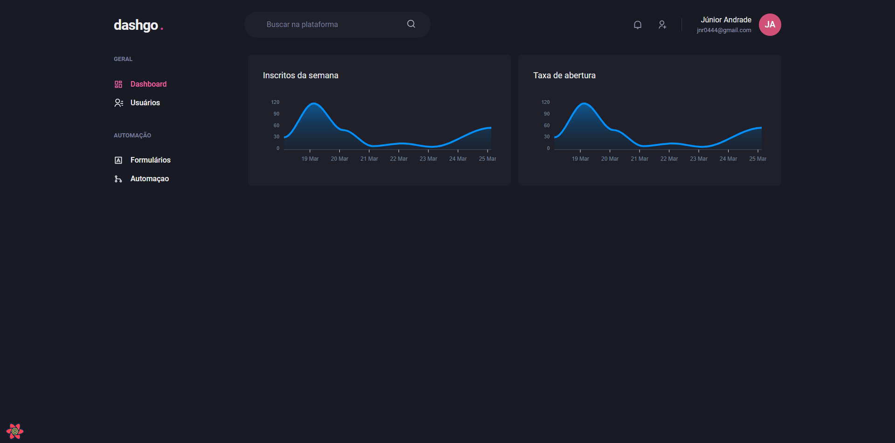

<h1 align="center">
  DashGo 📊
</h1>

<p align="center">
  
</p>

## 🚀 Tecnologias

Esse projeto foi desenvolvido com as seguintes tecnologias:

- [Chakra Ui](https://chakra-ui.com/)
- [hookform](https://react-hook-form.com/)
- [Emotion](https://emotion.sh/docs/introduction)
- [React Query](https://tanstack.com/query/v3/)
- [React Icons](https://react-icons.github.io/react-icons/)
- [Apexcharts](https://apexcharts.com/)
- [Framer Motion](https://www.framer.com/motion/)
- [Next](https://nextjs.org/)
- [Typescript](https://www.typescriptlang.org/)
- [Axios](https://axios-http.com/ptbr/docs/intro)
- [yup](https://www.npmjs.com/package/yup)

## Getting Started
### Install dependencies:

```bash
yarn 
```

## Commands

- `yarn dev`: run development server

Open [http://localhost:3000](http://localhost:3000) with your browser to see the result.

## 🚧 Projeto:

Concluido

Feito com ♥ by Joelson Junior